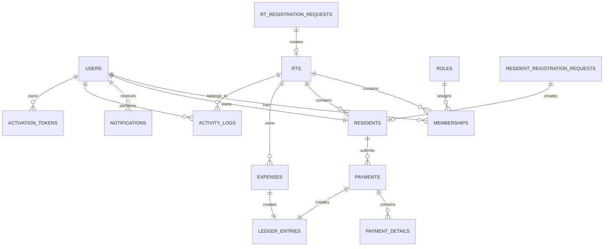

# ERD.md

> Project: KasWarga
>
> Version: 1.0
>
> Last Updated: July 2026

---

# Purpose

This document describes the Entity Relationship Diagram (ERD) of KasWarga.

The diagram focuses on logical relationships between entities.

Physical implementation details are documented in DATABASE_SCHEMA.md.

---

# Logical ER Diagram



---

# Domain Overview

```
Authentication

User

↓

Membership

↓

Role

↓

Permission
```

---

```
Organization

RT

↓

Resident

↓

Payment

↓

Ledger
```

---

```
Audit

Business Event

↓

Activity Log
```

---

```
Notification

Business Event

↓

Notification

↓

User
```

---

# Relationship Summary

## User

One User

↓

Many Memberships

↓

Many Notifications

↓

Many Activity Logs

---

## RT

One RT

↓

Many Residents

↓

Many Memberships

↓

Many Payments

↓

Many Expenses

---

## Resident

One Resident

↓

Many Payments

---

## Payment

One Payment

↓

Many Payment Details

↓

One Ledger Entry

---

## Expense

One Expense

↓

One Ledger Entry

---

## Registration

RT Registration

↓

RT

↓

Users

↓

Memberships

Resident Registration

↓

Resident

↓

Membership

---

# Cardinality

| Relationship | Cardinality |
|--------------|-------------|
| User → Membership | 1 : N |
| RT → Membership | 1 : N |
| RT → Resident | 1 : N |
| Resident → Payment | 1 : N |
| Payment → Payment Detail | 1 : N |
| Payment → Ledger Entry | 1 : 1 |
| Expense → Ledger Entry | 1 : 1 |
| User → Notification | 1 : N |
| User → Activity Log | 1 : N |

---

These modules should follow the same multi-tenant design by referencing `rt_id`.

---

# Design Principles

1. Every business entity belongs to an RT.
2. Financial records are immutable.
3. Membership controls authorization.
4. Notifications are asynchronous.
5. Activity Logs are append-only.
6. Dashboard aggregates data only.
7. Business rules live in Services.
8. Database stores state, not business logic.

---

End of Document